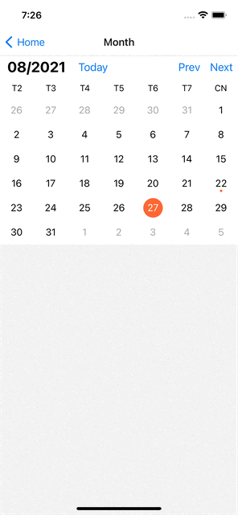
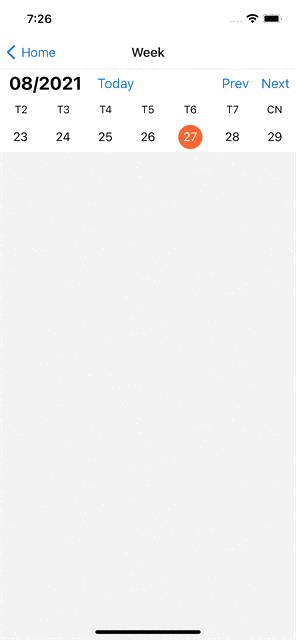

# Month Calendar



```typescript
import React, {useRef, useState} from 'react';
import {Button, Text, View} from 'react-native';
import {CalendarRef, Calendar} from 'react-native-scrollable-calendar';

export default function Screen() {
  const [date, setDate] = useState(new Date());
  const [month, setMonth] = useState(new Date().toISOString());
  const ref = useRef<CalendarRef>(null);

  return (
    <View style={{flex: 1}}>
      <Calendar
        ref={ref}
        autoSelect="firstday"
        markedDates={{
          '2021-08-22': {
            marked: true,
            type: 'dot',
          },
        }}
        selected={date}
        onSelectDate={(value, source) => {
          setDate(value as any);
        }}
        onMonthChange={m => {
          setMonth(m as any);
        }}
      />
    </View>
  );
}
```

# Week Calendar



```typescript
import React, {useRef, useState} from 'react';
import {Button, Text, View} from 'react-native';
import {WeekCalendarRef, WeekCalendar} from 'react-native-scrollable-calendars';

export default function Month() {
  const [date, setDate] = useState(new Date());
  const [week, setWeek] = useState(new Date().toISOString());
  const ref = useRef<WeekCalendarRef>(null);

  return (
    <View style={{flex: 1}}>
      <WeekCalendar
        ref={ref}
        autoSelect="firstday"
        markedDates={{
          '2021-08-22': {
            marked: true,
            type: 'dot',
            background: 'blue',
          },
        }}
        selected={date}
        onSelectDate={(value, source) => {
          setDate(value as any);
        }}
        onWeekChange={w => {
          setWeek(w);
        }}
      />
    </View>
  );
}
```

# Custom theme

```typescript
export interface CalendarTheme {
  selected?: {
    color: string;
    backgroundColor: string;
  };
  dot?: {
    color: string;
    selectedColor: string;
  };
  marked?: {
    color: string;
    background: string;
  };
  dayName?: TextStyle;
  header?: ViewStyle;
}

export interface Marking {
  type: 'dot' | 'dots';
  marked: boolean;
  selectedColor?: string;
  color?: string;
  background?: string;
  dots?: {color: string}[];
}
```
